# 🧬 Life OS - Personal Operating System

A complete life management app to track your goals, health, finances, relationships, and tasks.

---

## 📸 Screenshots

| | |
|---|---|
| **Login Page** | **Register Page** |
| 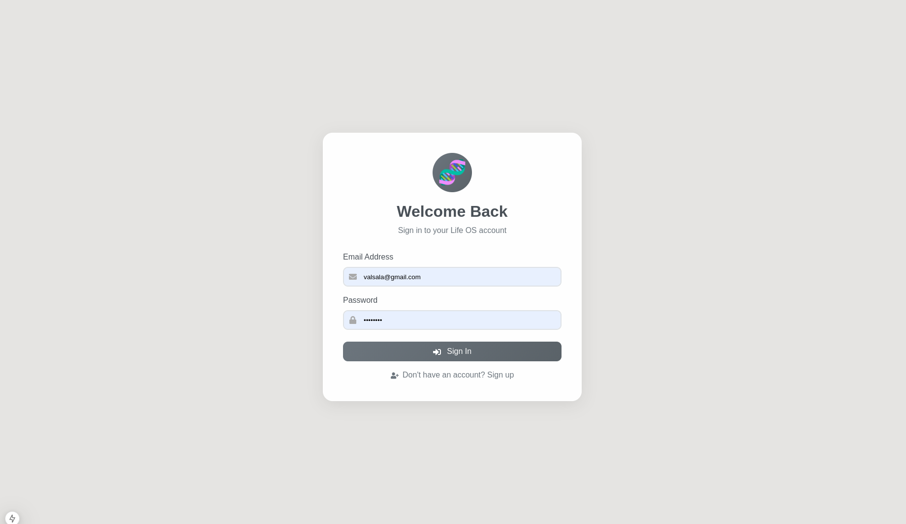 | 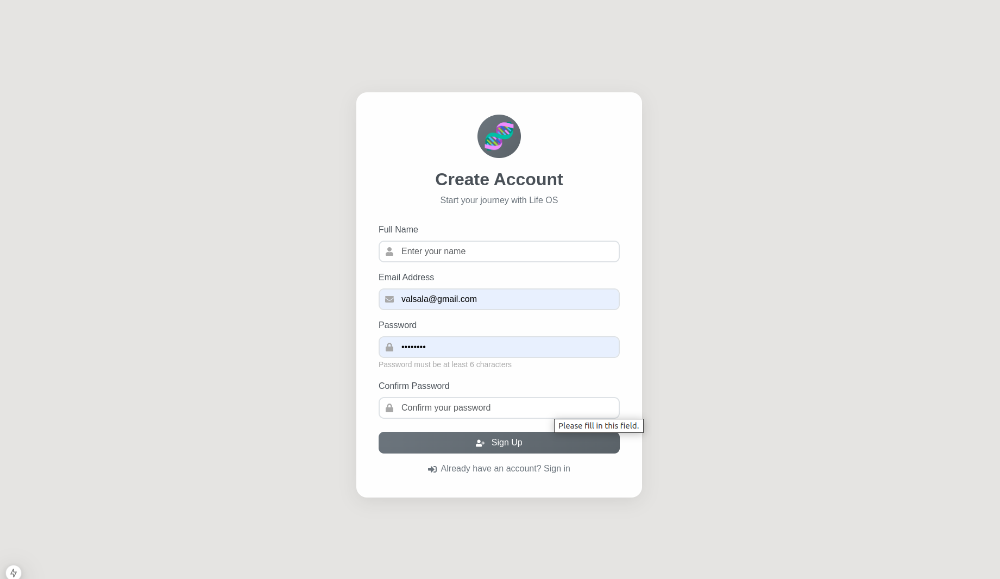 |

| **Dashboard** |
| 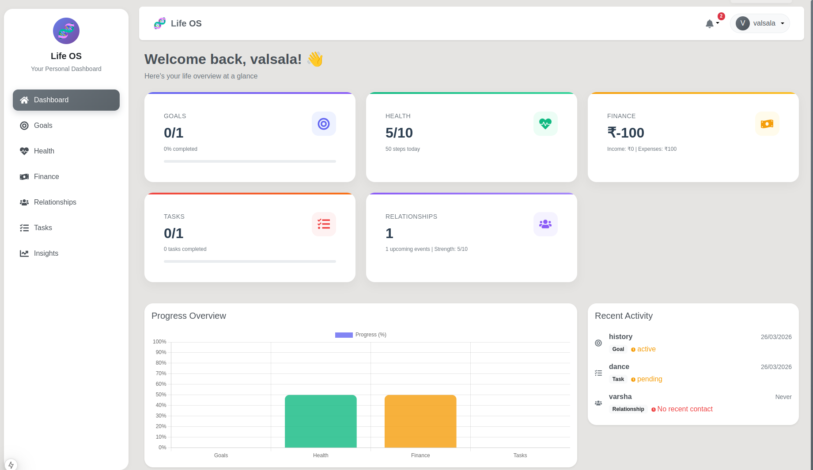 |

| **Goals** | **Create Goal** |
| 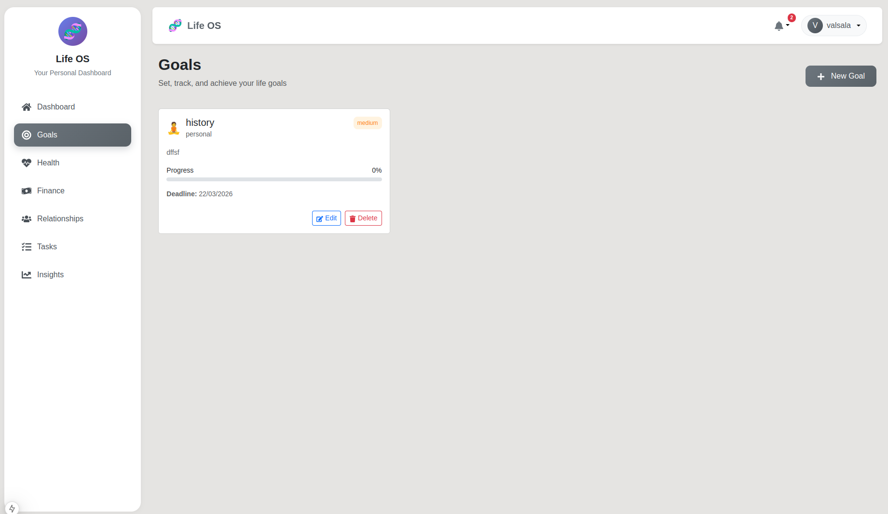 | 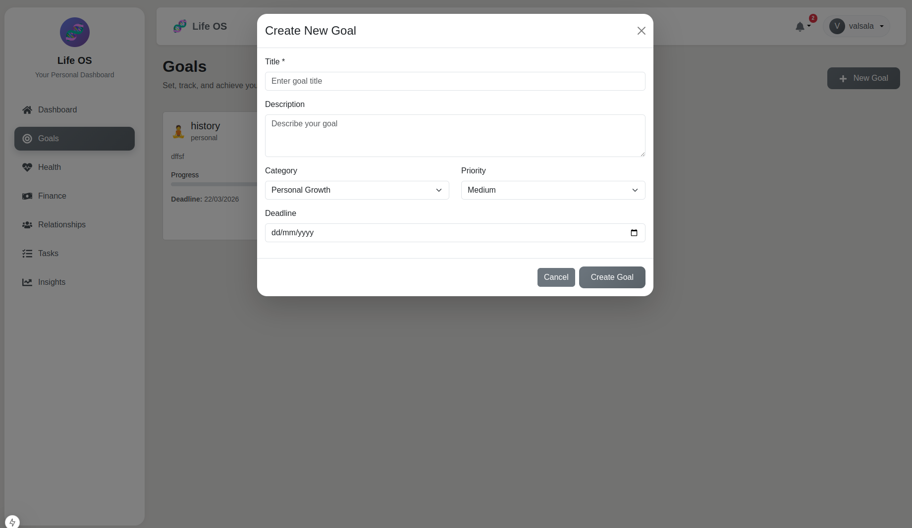 |

| **Health** |
| 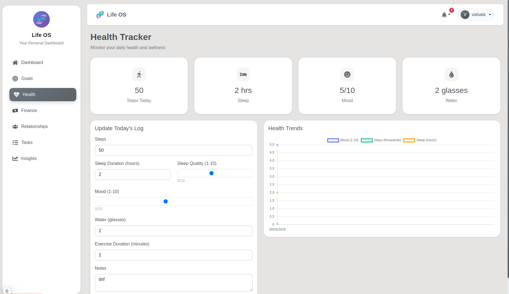 |

| **Finance** | **Add Transaction** |
| 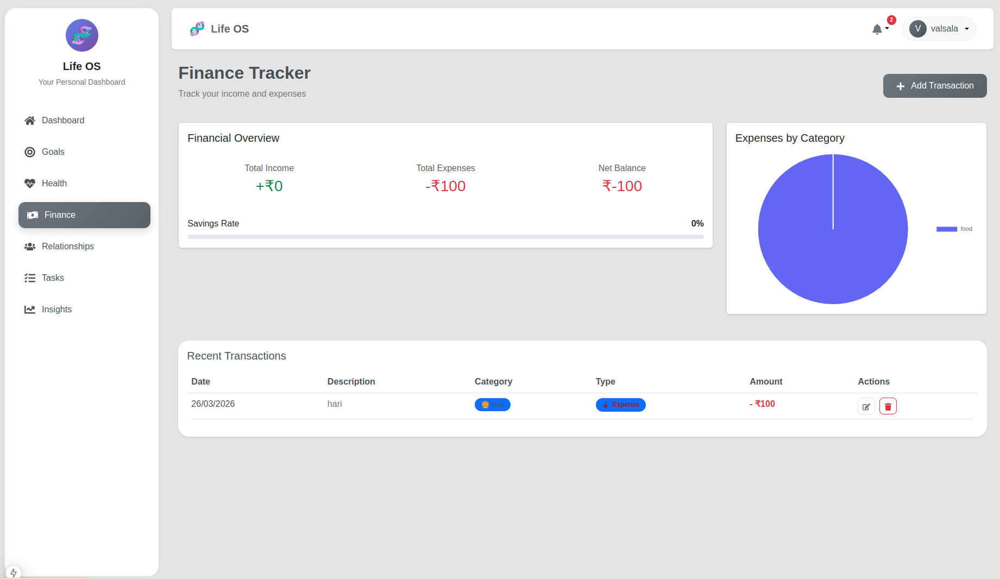 | 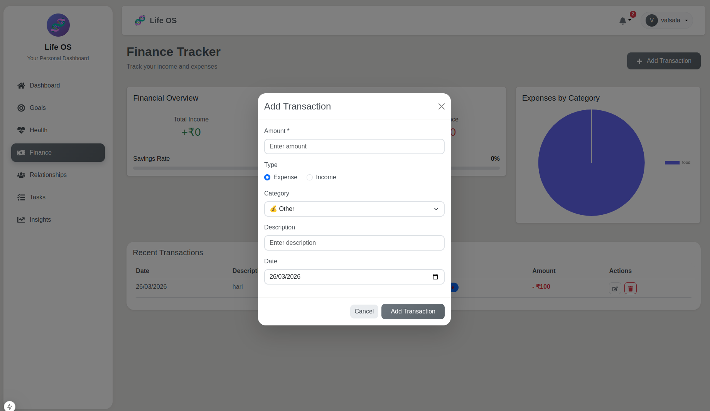 |

| **Relationships** | **Add Person** |
| 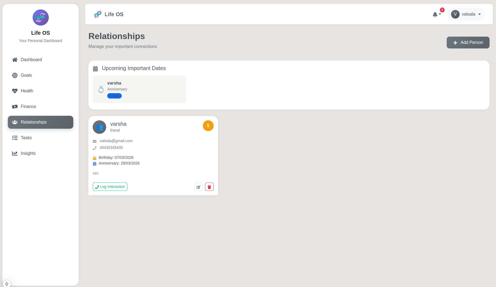 | 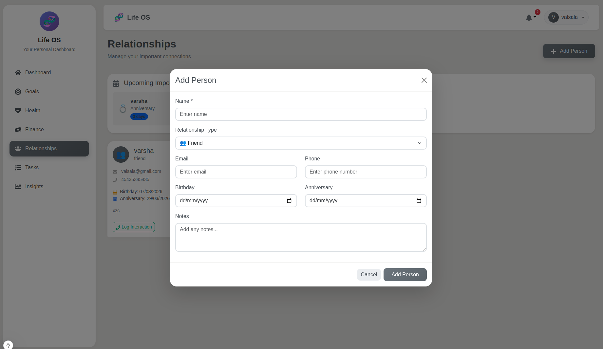 |

| **Tasks** | **Create Task** |
| 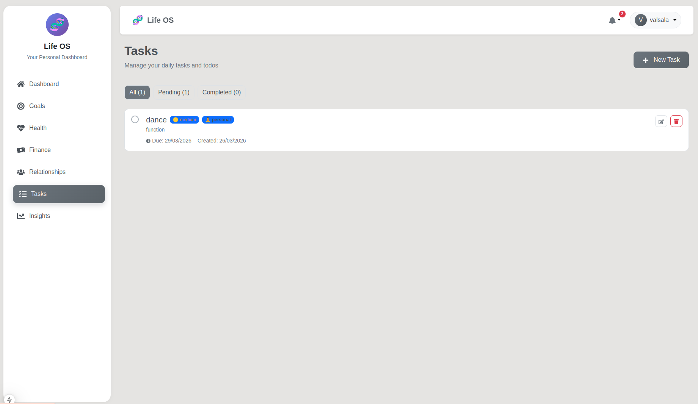 | 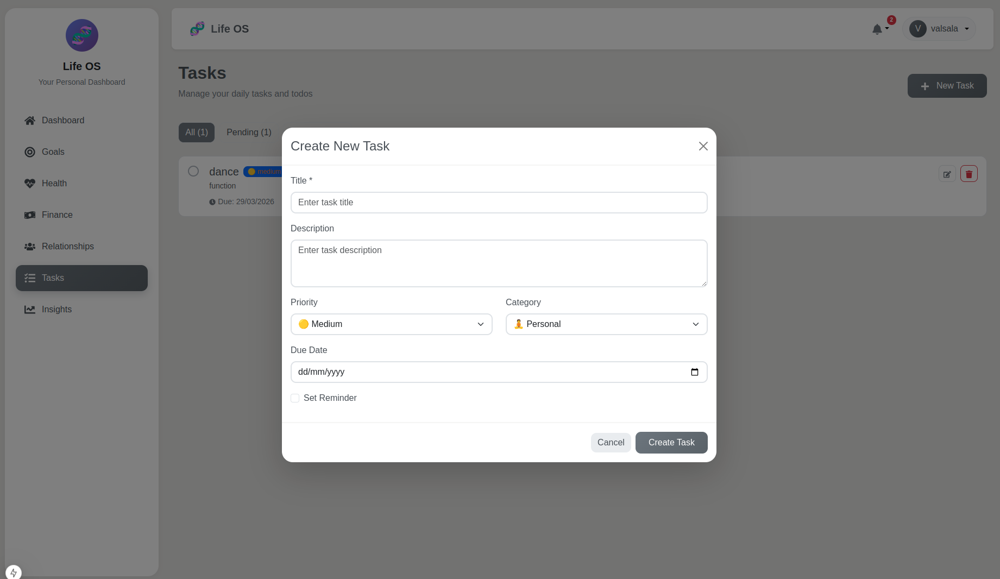 |

| **Insights** |
| 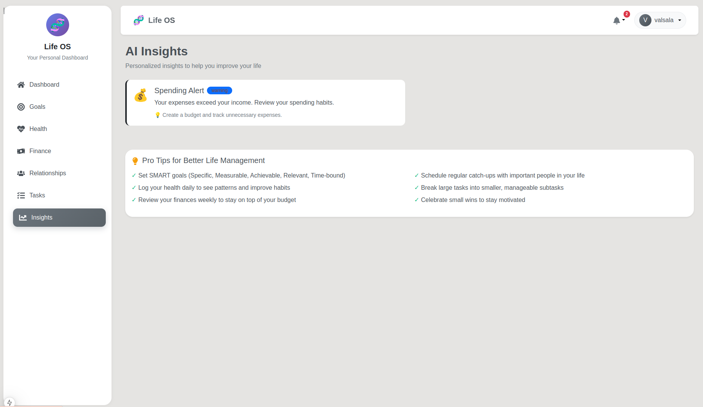 |

---

## 🚀 Tech Stack

- **Frontend**: Next.js 15, React 19, React Bootstrap
- **Backend**: Node.js, Express.js
- **Database**: MongoDB
- **Auth**: JWT, bcryptjs

---

## ⚡ Quick Start

```bash
# Clone repository
git clone https://github.com/VarshaVasudevan/life-os-app
cd life-os

# Install backend
cd backend
npm install

# Install frontend
cd ../frontend
npm install

# Setup environment
cp backend/.env.example backend/.env
cp frontend/.env.example frontend/.env.local

# Run backend (Terminal 1)
cd backend
npm run dev

# Run frontend (Terminal 2)
cd frontend
npm run dev